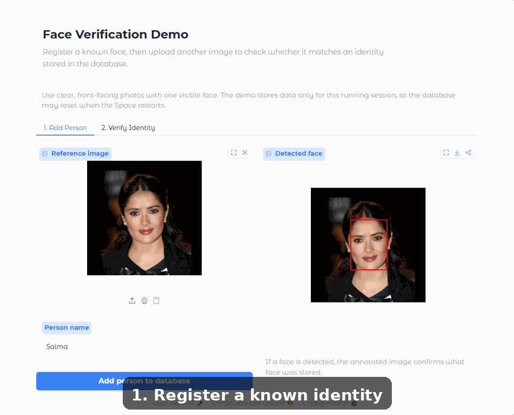
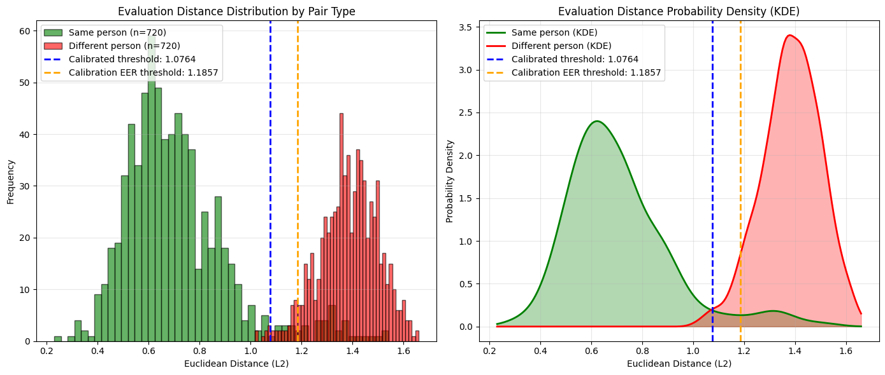
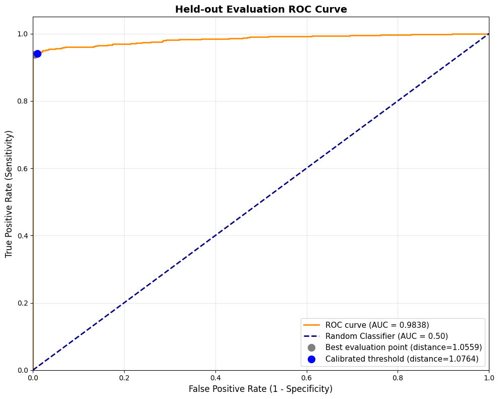
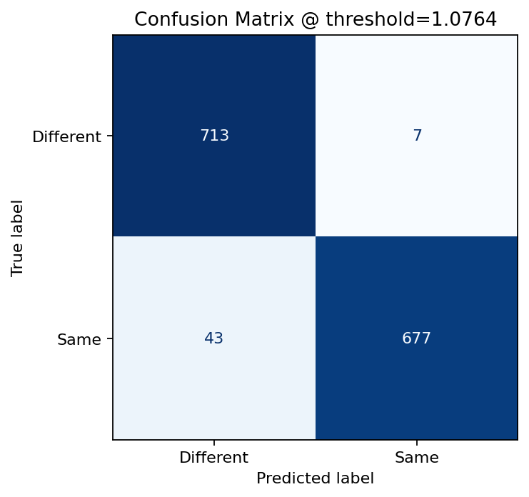

# Face Verification

AI Engineering Demo project demonstrating an end-to-end face verification workflow with FaceNet embeddings, ChromaDB vector search, and an interactive Gradio interface.

Try it on Hugging Face Spaces: https://huggingface.co/spaces/leandrodevai/faceverification

The app lets users add known people to a local embeddings database and verify whether a new face image matches one of the stored identities.



This demo was built to show that FaceNet, despite being an older architecture,
is still a strong and practical baseline for face embedding workflows. Its
moderate runtime footprint also makes it an interesting candidate for constrained
deployments, including edge-style scenarios when hardware, latency, and accuracy
requirements are compatible.

The project is also intended as a reusable AI engineering template: the same
structure can be adapted to build CI/CD pipelines for other models, or extended
from image uploads into a video pipeline for near real-time face recognition.

## Features

- Face detection and preprocessing from uploaded images
- FaceNet embedding extraction with PyTorch
- Similarity search with ChromaDB
- Interactive Gradio UI with add-person and verify-identity flows
- FastAPI interface for containerized API deployments
- Docker-based Hugging Face Space deployment

## Model Evaluation

The verification threshold was calibrated with a small study on the
`bitmind/lfw` dataset, a Hugging Face version of Labeled Faces in the Wild
(LFW). The study builds same-person and different-person image pairs, splits
them into calibration and held-out evaluation sets, and evaluates L2 distance
between L2-normalized FaceNet embeddings.

For this demo, the selected threshold is:

```text
same person if L2 distance <= 1.0764
different person if L2 distance > 1.0764
```

This value was chosen on the calibration split because it maximized balanced
accuracy while staying below the distance region where different-person pairs
start to dominate. The held-out evaluation split contains 720 same-person and
720 different-person pairs.



Held-out evaluation results:

| Metric | Value |
| --- | ---: |
| AUC-ROC | 0.9838 |
| Accuracy | 0.9653 |
| FAR | 0.0097 |
| FRR | 0.0597 |
| TPR | 0.9403 |
| Calibrated threshold | 1.0764 |
| Calibration EER threshold | 1.1857 |





These metrics are intended to justify the threshold for this demo dataset, not
as a production biometric benchmark.

## Tech Stack

- Python
- PyTorch
- FaceNet / facenet-pytorch
- ChromaDB
- FastAPI
- Gradio
- Docker / GHCR
- Hugging Face Spaces Docker SDK

## Run Locally

Using uv:

```bash
uv sync
uv run faceverification
```

Using pip:

```bash
pip install -r requirements.txt -e .
python -m faceverification.interfaces.gradio_app
```

## FastAPI Interface

The project includes an HTTP API for the same enroll-and-verify workflow.
Run it locally with:

```bash
uv run uvicorn faceverification.interfaces.fastapi_app:app --port 8000
```

Interactive API documentation is available at:

- Swagger UI: http://localhost:8000/docs
- ReDoc: http://localhost:8000/redoc

### Authentication

Protected endpoints require a bearer token. The default demo credentials are
`demo` / `demo123`; override them with `FACEVERIFICATION_DEMO_USERNAME` and
`FACEVERIFICATION_DEMO_PASSWORD` in `.env`. The JWT secret is also configurable
and should be changed outside local demos.

```env
FACEVERIFICATION_DEMO_USERNAME=demo
FACEVERIFICATION_DEMO_PASSWORD=demo123
FACEVERIFICATION_JWT_SECRET_KEY=replace-this-with-a-long-random-secret
FACEVERIFICATION_JWT_ACCESS_TOKEN_EXPIRE_MINUTES=60
FACEVERIFICATION_MAX_UPLOAD_BYTES=5242880
FACEVERIFICATION_DEBUG=false
FACEVERIFICATION_LOG_FORMAT=json
```

`FACEVERIFICATION_DEBUG=true` raises application logging to debug level and uses
a readable text formatter by default, which is useful for local troubleshooting.
Keep it `false` in normal deployments; Container Apps sends stdout logs to Log
Analytics, where the default JSON format is easier to query.

```bash
curl -X POST http://localhost:8000/auth/login \
  -F "username=demo" \
  -F "password=demo123"
```

Use the returned token in the `Authorization` header:

```bash
Authorization: Bearer <access_token>
```

### Endpoints

- `GET /health`: returns API status.
- `POST /auth/login`: returns a JWT access token for the demo user.
- `POST /persons`: enrolls a known person from an uploaded image and form `name`.
- `POST /verify`: verifies whether an uploaded face matches a known person.

Both face endpoints return an annotated image by default. Add
`?include_image=false` when the client only needs the JSON result.

## Deployment Notes

For API deployments, the recommended baseline is the FastAPI container running
Uvicorn:

```bash
uvicorn faceverification.interfaces.fastapi_app:app --host 0.0.0.0 --port 8000
```

This keeps the demo lightweight and avoids loading the FaceNet/MTCNN models in
multiple worker processes unnecessarily. Because each worker can hold its own
model instance in memory, increasing worker count should be done only after
checking available RAM and expected traffic.

Gunicorn with Uvicorn workers and an Nginx reverse proxy are valid production
options, but they are intentionally not required for the baseline deployment:

- Use Gunicorn/Uvicorn workers when the service needs a traditional process
  manager or multiple worker processes.
- Use Nginx when deploying on a self-managed VM that needs TLS termination,
  upload-size limits, reverse proxy routing, compression, or centralized access
  logs.
- On managed platforms such as Render, Railway, Fly.io, Cloud Run, or similar,
  the platform usually provides the external reverse proxy and TLS layer, so
  running Uvicorn directly inside the application container is sufficient.

### Docker

Build and run the FastAPI service:

```bash
docker compose up --build api
```

The API will be available at:

- http://localhost:8000/health
- http://localhost:8000/docs

Run the optional Gradio interface:

```bash
docker compose --profile gradio up --build
```

The Gradio UI will be available at http://localhost:7860.

Both services are built from the same `Dockerfile`. The heavy application
layers live in the shared `app` stage; the `fastapi` and `gradio` stages only
set different default commands:

- `fastapi`: published to GHCR by the container workflow.
- `gradio`: used by the Hugging Face Docker Space.

The published FastAPI image is tagged as:

```text
ghcr.io/leandrodevai/faceverification:fastapi
```

Each successful container workflow also publishes an immutable SHA tag with the
`fastapi-sha-*` prefix.

By default, ChromaDB runs in memory, so
enrolled faces are ephemeral and disappear when the container restarts. This is
intentional for the demo baseline.

To persist embeddings to disk, provide a database name:

```bash
FACEVERIFICATION_VECTOR_DB_NAME=local-demo \
  docker compose -f docker-compose.yml -f docker-compose.persist.yml up --build api
```

The base `docker-compose.yml` does not mount any volume, so the default
deployment stays ephemeral. The optional `docker-compose.persist.yml` override
mounts the `faceverification-data` volume at `/data` and translates
`FACEVERIFICATION_VECTOR_DB_NAME` into
`FACEVERIFICATION_VECTOR_DB_PERSIST_DIRECTORY=/data/chroma/<name>` before the
application starts. The application itself still defaults to in-memory ChromaDB
unless `FACEVERIFICATION_VECTOR_DB_PERSIST_DIRECTORY` is explicitly provided.

The default container configuration sets `FACEVERIFICATION_DEVICE=cpu` to keep
deployment portable.

Local Docker Compose defaults `FACEVERIFICATION_DEBUG=true` and
`FACEVERIFICATION_LOG_FORMAT=text` for developer ergonomics. Azure Container
Apps sets `FACEVERIFICATION_DEBUG=false` and `FACEVERIFICATION_LOG_FORMAT=json`
for lower-volume structured logs in Log Analytics.

The shared local ChromaDB volume is intended for a small demo deployment when a
persist name is enabled. For a multi-container production setup with concurrent
writers or multiple replicas, use an external database/vector-store service or
make one service the clear owner of writes.

For production deployments, override at least:

```bash
FACEVERIFICATION_DEMO_USERNAME
FACEVERIFICATION_DEMO_PASSWORD
FACEVERIFICATION_JWT_SECRET_KEY
```

### Azure Container Apps

The FastAPI image can also be deployed as an ephemeral Azure Container App from
the GHCR image published by the container workflow.

The deployment is defined in `infra/bicep/main.bicep` and is wired to
`.github/workflows/deploy-azure-container-app.yml`. The workflow:

- creates or reuses the Azure resource group configured in GitHub repository
  variables;
- deploys a Log Analytics workspace, Container Apps environment, and FastAPI
  Container App;
- runs the published `ghcr.io/leandrodevai/faceverification:fastapi` image;
- keeps the app ephemeral with no mounted volume or external vector database;
- configures `minReplicas: 0` and `maxReplicas: 1`;
- smoke tests `GET /health` after deployment.

Required GitHub repository variables:

```text
AZURE_CLIENT_ID
AZURE_LOCATION
AZURE_RESOURCE_GROUP
AZURE_TENANT_ID
AZURE_SUBSCRIPTION_ID
```

Required GitHub repository secrets:

```text
FACEVERIFICATION_DEMO_USERNAME
FACEVERIFICATION_DEMO_PASSWORD
FACEVERIFICATION_JWT_SECRET_KEY
```

To avoid ongoing cost while keeping the OIDC and RBAC setup intact, remove the
demo resources inside the configured resource group from Azure when they are no
longer needed.

Example enrollment request:

```bash
curl -X POST http://localhost:8000/persons \
  -H "Authorization: Bearer <access_token>" \
  -F "name=Ada Lovelace" \
  -F "image=@test/images/person_anchor.jpg"
```

Example verification request:

```bash
curl -X POST http://localhost:8000/verify \
  -H "Authorization: Bearer <access_token>" \
  -F "image=@test/images/person_positive.jpg"
```

## Project Structure

```text
src/faceverification/
  config.py
  core/
    image_processor.py
    vectordb.py
  interfaces/
    fastapi_app.py
    gradio_app.py
  services/
    face_verification.py
```

## Demo Focus

This project highlights practical AI engineering skills: model-based feature extraction, vector database integration, application packaging, automated deployment, and a simple user-facing ML interface.
